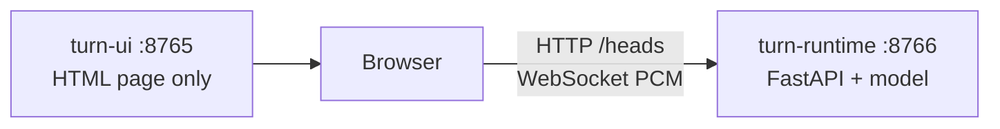

# Architecture

When a human talks to a voice agent, the agent has to know when to start
speaking. Jump in too soon and it interrupts; wait too long and it feels
slow. 

This document explains how our implementation of the detector works, what model powers it, where the dataset that was used to train it comes from, and how the FastAPI services that power the detector fit together.

## Overview

Most audio produced by the human during the conversation doesn't reach the classifier model. Loudness is measured on 20 ms frames (with an energy VAD). While the signal is loud, the state is `speaking`. A dip shorter than 100 ms is still treated as speech.

After 100 ms of silence it is a real pause with high probability, and only then we send an audio clipt to our classifier. The output score is **`p(eot)`**, the probability that this pause is the end of the turn. By default, `p(eot) ≥ 0.5` is `eot` and below that is `hold` (although of course the threshold can be moved anywhere in `[0, 1]` if you would rather interrupt less, or wait less).

If silence lasts three seconds we return `eot` without scoring. That is
long enough to be almost sure that it's really an end-of-turn, and also long enough to be out of distribution for the dataset used to train the model.

The classifier sees only human audio up to *now*, at most the last five
seconds — nothing after the pause, and nothing from the agent.

```mermaid
flowchart TD
  pcm[Human audio] --> loud{Frame is loud?}
  loud -->|yes| speaking[speaking]
  loud -->|no| gap{How long has it been quiet?}
  gap -->|under 100 ms| speaking
  gap -->|100 ms to 3 s| model[Score p(eot)]
  model -->|below 0.5| hold[hold]
  model -->|at least 0.5| eot[eot]
  gap -->|3 s or more| eot
```

## The ML model

The backbone is [`openai/whisper-tiny`](https://huggingface.co/openai/whisper-tiny).
Whisper is an encoder–decoder ASR model. We keep only the **encoder**
(the `model.encoder.*` tensors) and discard the decoder: no transcript,
no language token, no Whisper timestamps.

This encoder is small enough to run on CPU (although in this case it has
been run on a RTX 5090 GPU), and it was pretrained on multilingual speech.

Whisper does not take the raw waveform in **PCM**
(pulse-code modulation). We first resample those samples to 16 kHz, then
turn them into a **log-mel spectrogram** of **10 ms** and **80 mel bands** (coarser at high
Hz, finer at low Hz, closer to human hearing) and log-compressed.

The official Whisper was trained on 30s clips, but in our case, our clips are **at most 5 s**
of human audio ending at the pause — shorter if the turn is shorter.

We then **mean-pool**: average the (however many) vectors we got per clip
into a single 384-d vector. The 384-d average then goes
through a small MLP (`384 → 64 → GELU → 1`, about 25k parameters), which is finally
sent to a sigmoid and used to predict `eot`/`hold`.

## Training

We freeze the encoder and train only the MLP. Because the encoder never
changes, each clip is encoded once at the start of a training job and the
384-d vectors sit in memory. The epochs then fit the tiny head, so the
slow part is that first pass, not the optimization. Once the optimizer starts,
it takes less than 10s to reach the max accuracy / min loss, training for about 7-8 epochs.

How to launch a run is in [`SETUP.md`](SETUP.md#data-and-training).

## Dataset

The head is trained on
[`livekit/eot-bench-data`](https://huggingface.co/datasets/livekit/eot-bench-data):
real human turns from task-oriented voice-agent calls, in 14 languages,
with every silence of at least 100 ms marked. We download the public
`validation` split (the only published split) into `data/raw_dataset/`.
Text and dialogue columns are ignored; only `audio` and `silence_spans`
are used.

Then we prepare the training dataset out of the previous files. As specified in the
Hugging Face repo, we treat earlier silence spans in a turn as `hold`; the last span is `eot`.

Then, inside a span we cut at 200 ms after the start (if the pause is long enough), at 1 s for `eot` pauses, and at the end of the pause. Each clip is the audio **up to** that cut, at
most five seconds back, resampled to 16 kHz mono — the same view the
runtime has.

We hash turn ids into an 80/20 train/val split of the clips we cut
(making sure that clips from the same turn stay on the same split):

| | hold | eot | total |
| --- | ---: | ---: | ---: |
| train | 13,311 | 11,684 | 24,995 |
| val | 3,188 | 2,818 | 6,006 |
| all | 16,499 | 14,502 | 31,001 |

It's worth mentioning that those numbers are close to balanced: 53% hold, 47% eot, and
we do not resample later on. For the training, we use Adam on a binary cross-entropy on the logits loss (`BCEWithLogitsLoss`) with `pos_weight = n_hold / n_eot` ≈ 1.14 so the
slightly rarer `eot` class is not ignored.

## Serving

We serve **two different programs**, both based on [FastAPI](https://fastapi.tiangolo.com/) apps.
FastAPI is a Python library for HTTP servers.
[Uvicorn](https://www.uvicorn.org/) is the process that binds a TCP port.

| Program | Command | Port | What it is |
| --- | --- | --- | --- |
| Runtime | `turn-runtime-serve` | 8766 | Loads Whisper + the pause head. This is the detector. |
| UI | `turn-ui` | 8765 | Serves one HTML page to test the service. |

The browser loads the test page from port **8765**. Microphone audio then
goes from the browser to port **8766**. The UI server only hands the
page to the user, but it never actually sees the audio.

- Ordinary HTTP on the runtime: `GET /health`, `GET /heads` (list trained
  pause heads).
- A **WebSocket** on `ws://…:8766/ws`: the browser sends PCM samples;
  the runtime replies with `{speaking, hold, eot}` and `p(eot)`. A
  WebSocket is a long-lived TCP connection, not one HTTP request per
  chunk. Details are in [Live protocol](#live-protocol).

One Whisper encoder is loaded when the runtime starts, and every
connection shares it. Each browser tab still has its own VAD / silence
timers.



Run commands are in [`SETUP.md`](SETUP.md#live-ui).

## Live protocol

Same FastAPI process, same port **8766**. `GET /health`, `GET /version`,
and `GET /heads` are ordinary HTTP. `GET /ws` is upgraded in place to a
WebSocket (the browser asks to switch protocols; Uvicorn keeps the TCP
connection open).

| Direction | Payload |
| --- | --- |
| Client → server (text) | `{ "type": "start", "sampleRate": 48000, "head": "current" }` |
| Client → server (binary) | Little-endian float32 mono PCM (waveform samples) |
| Server → client (JSON) | `{ "ok", "state", "silence_seconds", "rms", "p_eot" }` |

The page already has samples from the microphone (`getUserMedia`). A
WebSocket is the simple way to send them continuously. REST would mean a
new HTTP request per chunk. WebRTC would add ICE, DTLS, and a codec we
do not need: there is no peer-to-peer call here.

The Whisper encoder is shared and locked: one forward at a time per
runtime process. Stress tests should hit `/ws` and not assume N sockets
mean N parallel inferences.
