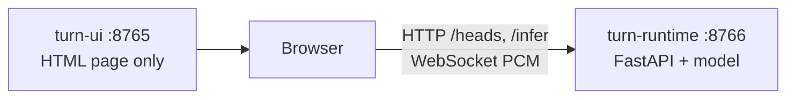

# Architecture

When a human talks to a voice agent, the agent needs to know when to start
speaking. Jump in too soon and you interrupt; wait too long and the call
feels sluggish.

This doc covers the decision path, the model, the training data, and how the
two FastAPI processes fit together.

## Overview

Most of the human audio never reaches the classifier. An energy VAD measures
loudness on 20 ms frames. While the signal is loud, the state is `speaking`.
A dip shorter than 100 ms still counts as speech.

After 100 ms of silence we treat it as a real pause and score a clip with the
classifier. The score is **`p(eot)`** — probability that this pause is the end
of the turn. By default `p(eot) ≥ 0.5` is `eot`, otherwise `hold`. On the live
WebSocket path that cutoff is per session (default `0.5`, overridable in
`[0, 1]` via `start.threshold` or a mid-stream `{type:"threshold"}` message).

If silence lasts three seconds we return `eot` without scoring. That is long
enough to be a clear turn end, and outside the pauses in the training set.

The classifier sees only human audio up to *now*, at most the last five
seconds — nothing after the pause, and nothing from the agent.

```mermaid
flowchart TD
  pcm[Human audio] --> loud{Frame is loud?}
  loud -->|yes| speaking[speaking]
  loud -->|no| gap{How long has it been quiet?}
  gap -->|under 100 ms| speaking
  gap -->|100 ms to 3 s| model[Score p(eot)]
  model -->|below 0.5| hold[hold]
  model -->|at least 0.5| eot[eot]
  gap -->|3 s or more| eot
```

## The ML model

The backbone is [`openai/whisper-tiny`](https://huggingface.co/openai/whisper-tiny).
Whisper is an encoder–decoder ASR model. We keep only the **encoder**
(`model.encoder.*`) and discard the decoder: no transcript, no language
token, no Whisper timestamps. The encoder is small enough for CPU and was
pretrained on multilingual speech.

Input is not raw PCM as Whisper saw it in ASR training. We resample to
16 kHz, build an **80-band log-mel** spectrogram at a **10 ms** hop, then run
the encoder. Clips are **at most 5 s** of human audio ending at the pause
(shorter if the turn is shorter). Official Whisper training used 30 s clips;
we do not.

Encoder frames are pooled to one 384-d vector. Supported pools (from each
run’s `config.json`):

| Pool | Meaning |
| --- | --- |
| `mean` | Average every frame in the ≤5 s clip |
| `tail` | Average only the last `pool_ms` ms (~50 frames/s) |
| `ema` | Normalized recency-weighted mean with half-life `pool_ms` |

That vector goes through a pause head — either **linear** (`384 → 1`) or a
small GELU MLP (`linear-64-gelu-linear`). The logit is sigmoid’d to
`p(eot)`. Training default is linear + **tail 1000 ms**. The Docker image
serves linear + **EMA 400 ms** (`20260921-084831`). Local `turn-runtime`
loads whatever `models/pause_head/current` points at.

## Training

We freeze the encoder and train only the head. Each clip is encoded once at
the start of a job; the 384-d vectors stay in memory, so the slow part is
that first pass. Fitting the head itself is quick (best val often within
the first ~10 s / ~7–8 epochs).

How to launch a run: [`SETUP.md`](SETUP.md#data-and-training).

## Dataset

The head is trained on
[`livekit/eot-bench-data`](https://huggingface.co/datasets/livekit/eot-bench-data):
real human turns from task-oriented voice-agent calls, in 14 languages,
with every silence of at least 100 ms marked. We download the public
`validation` split (the only published split) into `data/raw_dataset/`.
Text and dialogue columns are ignored; only `audio` and `silence_spans`
are used.

Then we prepare the training set. As in the Hugging Face card, earlier
silence spans in a turn are `hold`; the last span is `eot`.

Inside a span we cut at 200 ms after the start (if the pause is long enough),
at 1 s for `eot` pauses, and at the end of the pause. Each clip is the audio
**up to** that cut, at most five seconds back, resampled to 16 kHz mono —
the same view the runtime has.

We hash turn ids into an 80/20 train/val split of the clips we cut
(clips from the same turn stay on the same split):

| | hold | eot | total |
| --- | ---: | ---: | ---: |
| train | 13,311 | 11,684 | 24,995 |
| val | 3,188 | 2,818 | 6,006 |
| all | 16,499 | 14,502 | 31,001 |

Classes are close to balanced (53% hold / 47% eot); we do not resample.
Training uses Adam and `BCEWithLogitsLoss` with
`pos_weight = n_hold / n_eot` ≈ 1.14 so the slightly rarer `eot` class is
not ignored.

## Serving

Two processes, both FastAPI behind Uvicorn:

| Program | Command | Port | What it is |
| --- | --- | --- | --- |
| Runtime | `turn-runtime-serve` | 8766 | Whisper + pause head (the detector) |
| UI | `turn-ui` | 8765 | One HTML page to exercise the detector |

The browser loads the page from **8765**; microphone audio goes to **8766**.
The UI server never sees the audio.

- HTTP on the runtime: `GET /health`, `GET /heads`, `POST /infer` (WAV in →
  `p(eot)` and `latency_ms`).
- WebSocket on `ws://…:8766/ws`: PCM in, `{speaking, hold, eot}` and
  `p(eot)` out. Details: [Live protocol](#live-protocol).

One Whisper encoder is loaded at runtime startup and shared (locked) across
connections. Each browser tab has its own VAD / silence timers.



Run commands are in [`SETUP.md`](SETUP.md#live-ui).

## Live protocol

Same process and port **8766**. `GET /health`, `GET /version`, and
`GET /heads` are ordinary HTTP; `GET /ws` upgrades to a WebSocket.
| Direction | Payload |
| --- | --- |
| Client → server (text) | `{ "type": "start", "sampleRate": 48000, "head": "current", "threshold": 0.5 }` |
| Client → server (text) | `{ "type": "head", "id": "current" }` |
| Client → server (text) | `{ "type": "threshold", "value": 0.5 }` |
| Client → server (binary) | Little-endian float32 mono PCM (waveform samples) |
| Server → client (JSON) | `{ "ok", "state", "silence_seconds", "rms", "p_eot" }` |

The page already has microphone samples (`getUserMedia`). A WebSocket
streams them continuously; REST would be one request per chunk.

The Whisper encoder is shared and locked: one forward at a time per
runtime process. Extra clients mostly queue.

`turn-runtime-stress` is an encoder bench, not a socket flood. It replays
clips from `data/train_dataset/` (in-process, or `POST /infer` with
`--url`) at offered rates. A short closed-loop warmup is discarded, then
each rate records achieved req/s and latency (client wall clock, and the
`/infer` `latency_ms` field). Output: markdown report + plots under
`data/stress_tests/<datetime>/`. How to run:
[`SETUP.md`](SETUP.md#encoder-throughput).
