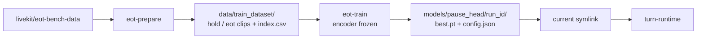

# Setup

Python 3.11–3.13. From the repo root:

```bash
uv venv
source .venv/bin/activate
uv sync --all-packages
uv run pre-commit install
uv run --package turn-runtime python -m turn_runtime.download
```

That last command snapshots Whisper-tiny into gitignored
`models/whisper-tiny/`. Optional env overrides: [`.env.example`](.env.example).

`HOST` and `PORT` are per process. Do not set them in a shared `.env` if
you run both the runtime and the UI from this directory.

## Live UI

```bash
uv run --package turn-runtime turn-runtime-serve
uv run --package turn-ui turn-ui
```

Open [http://127.0.0.1:8765](http://127.0.0.1:8765) and click **Start listening**.
The page defaults to the runtime at [http://127.0.0.1:8766](http://127.0.0.1:8766)
(`RUNTIME_URL`, overridable on the page). The runtime loads Whisper-tiny and
`models/pause_head/current` at startup. The **ML Model** menu lists runs under
`models/pause_head/`.

To point the UI at a container, set `RUNTIME_URL` or the Model API IP field to
`http://<host>:<port>` (see [Docker](#docker)). How the two processes
relate is in [`ARCHITECTURE.md`](ARCHITECTURE.md#serving).

## File CLI

```bash
uv run --package turn-runtime turn-runtime path/to/audio.wav
```

Logs JSON with `state`, `silence_seconds`, `rms`, and `p_eot` (`LOG_LEVEL`,
default INFO). Same VAD + head path in-process; it does not call HTTP.

## Encoder throughput

After `eot-prepare` (so `data/train_dataset/` exists):

```bash
uv run --package turn-runtime turn-runtime-stress
uv run --package turn-runtime turn-runtime-stress --url http://127.0.0.1:8766
```

This is **not** a WebSocket load test. It scores training clips with the
same encoder + pause head the runtime uses, and asks: at this many clip
scores per second, what does latency look like?

Default: 2 s closed-loop **warmup** (discarded), preload 128 clips, then
for each of `--rps 1,2,4,8,max` measure `--seconds 10`. `1,2,4,8` are
open-loop offered rates in **req/s** (try to start that many scores per
second). `max` keeps `--workers` busy until the encoder cannot go faster.
`--url` POSTs the same WAVs to `POST /infer` on a running server; without
it, the CLI loads Whisper in-process. `--warmup-seconds 0` skips warmup.

Each run writes `data/stress_tests/<YYYY-MM-DDTHH-MM-SS>/` (gitignored
with the rest of `data/`):

| File | Contents |
| --- | --- |
| `report.md` | Summary table (units on every column) plus the plots |
| `latency_distribution.png` | Encoder+lock latency box plot per offered rate |
| `throughput.png` | Achieved vs offered req/s, and p50/p99 vs rate |
| `summary.json` | The same numbers, machine-readable |
| `samples.csv` | One row per *measured* clip score (warmup excluded) |

`--output-dir` overrides the folder. Extra `--workers` mostly queue on
the shared encoder lock; they do not run N forwards in parallel. What
the numbers mean is in [`ARCHITECTURE.md`](ARCHITECTURE.md#serving).

## Data and training

```bash
uv run --package eot-ml-core eot-prepare
uv run --package eot-ml-core eot-train
uv run --package eot-ml-core tensorboard --logdir models/pause_head
```
These commands do **not** all download the same thing.

1. **Whisper-tiny** (the frozen encoder) is *not* fetched by `eot-prepare`.
   The command at the top of this file writes it to `models/whisper-tiny/`.
   If that snapshot is missing, `eot-train` downloads it before it starts.
2. **The training set** *is* fetched by `eot-prepare`: it pulls
   [`livekit/eot-bench-data`](https://huggingface.co/datasets/livekit/eot-bench-data)
   into `data/raw_dataset/` (Hugging Face cache, first run is large) and
   writes labeled clips to `data/train_dataset/`.
3. **`eot-train`** reads those clips, encodes them with Whisper-tiny, and
   trains only the pause head. It does not download the dataset again.

Each `eot-train` writes a **new** `models/pause_head/<run_id>/` folder
(`best.pt`, `config.json`, TensorBoard logs). It does not overwrite older
run directories. By default it retargets the `current` symlink at the new
run. To keep serving the previous head, pass `--no-promote`.

Default `eot-train` is a **linear** `384 → 1` head with a **tail** pool over
the last **1 s** of encoder frames (~50 steps at 50 Hz). Shorter clips use
whatever frames they have. Pool modes: `mean`, `tail`, `ema` (see
`--pool` / `--pool-ms`).

```bash
# Default recipe (linear + tail 1 s); keep previous current:
uv run --package eot-ml-core eot-train --head linear --pool tail --pool-ms 1000 --epochs 100 --no-promote

# Same shape as the Docker bake (linear + EMA 400 ms):
uv run --package eot-ml-core eot-train --head linear --pool ema --pool-ms 400 --epochs 100 --no-promote
```

`--no-promote` leaves `current` alone. Pick the new run in the ML Model menu,
or point `current` at it later. The Docker image does **not** follow your local
`current`; it pins run `20260921-084831` (Linear, EMA 400 ms).

Clip labels and the train/val split are described in
[`ARCHITECTURE.md`](ARCHITECTURE.md#dataset).



## Docker

A standalone image for `turn-runtime` lives in
[`docker/turn_runtime`](docker/turn_runtime/README.md). It copies Whisper-tiny
and `models/pause_head/20260921-084831/` (Linear, EMA 400 ms) into
`/models/pause_head/current/` in the image. Plain `eot-train` does not create
that run; use the folder already on disk, or train with
`--pool ema --pool-ms 400` as above.

```bash
docker build -t eot-runtime:local -f docker/turn_runtime/Dockerfile .
docker run --rm -p 8766:8766 eot-runtime:local
```

Then run `turn-ui` and set Model API IP to `http://127.0.0.1:8766` (or the
machine IP if the UI is elsewhere). The image listens on `0.0.0.0:8766` and
sets `CORS_ALLOWED_ORIGINS=*`.

## Development

```bash
uv run pytest
uv run ruff check .
uv run ruff format --check .
```

`data/` and `models/` are gitignored. Package internals live in
`packages/<name>/src/<pkg>/README.md`.
